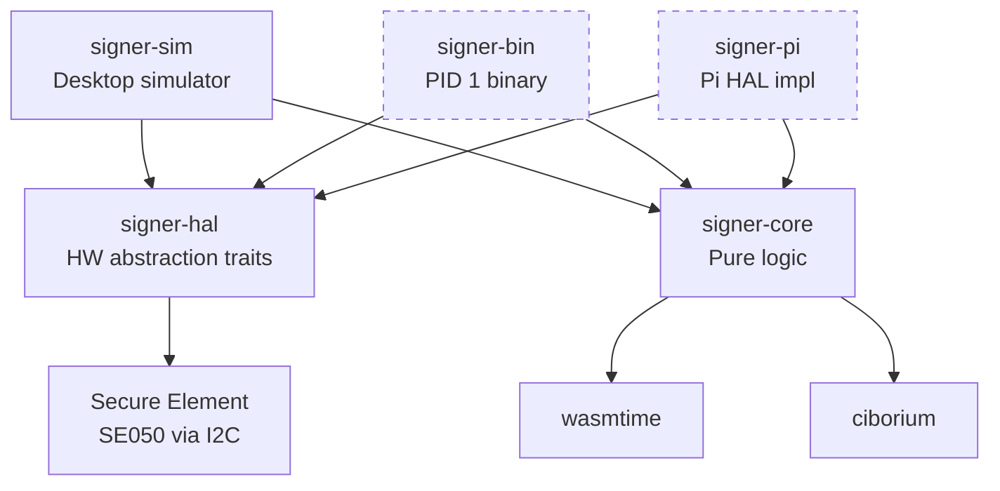

# Architecture Overview

## Crate structure

| Crate | Status | Purpose |
|-------|--------|---------|
| `signer-core` | done | Pure logic: spec types, WASM sandbox, display, hash extraction |
| `signer-hal` | done | Trait definitions: `Display`, `Buttons`, `UsbMount`, `SecureElement` |
| `signer-sim` | done | Desktop simulator: minifb window, keyboard, simulated SE with PIN + keystore |
| `usb-pack` | stub | CLI tool to prepare USB stick contents |
| `signer-pi` | Phase 4 | Raspberry Pi implementation: linuxfb, gpiod, mount, I2C SE050 |
| `signer-bin` | Phase 4 | The PID 1 binary (state machine orchestrating everything) |

## Device flow

## Interpreters

WASM modules are carried on the USB stick alongside the transaction payload. Each blockchain ecosystem ships its own interpreter:

| Interpreter | Status | Format | Output |
|-------------|--------|--------|--------|
| `echo-hex` | done | Any | Hex dump (testing) |
| `cardano-cbor` | Phase 2 | Cardano TX CBOR | Structured JSON (inputs, outputs, fee, metadata) |
| `bitcoin-psbt` | future | Bitcoin PSBT | Structured JSON (inputs, outputs, fee) |

Interpreters are compiled to `wasm32-unknown-unknown` and must export:

- `alloc(size) → ptr` — bump allocator
- `interpret(ptr, len) → ptr` — parse payload, return length-prefixed JSON
- `assemble(payload_ptr, payload_len, sig_ptr, sig_len) → ptr` — (optional) combine payload + signature
