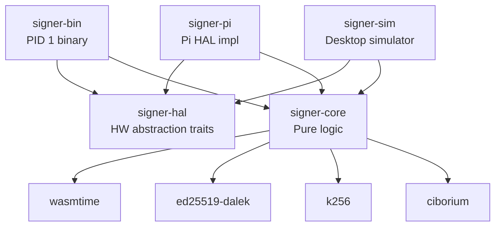
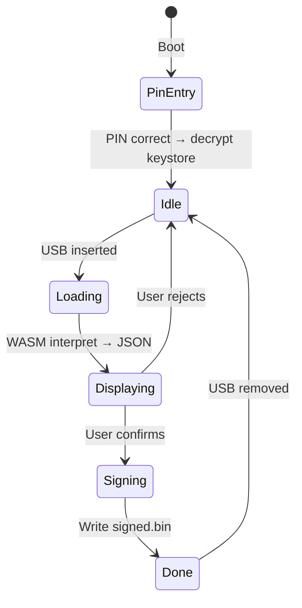

# Architecture Overview

## Crate structure

| Crate | Purpose |
|-------|---------|
| `signer-core` | Pure logic: spec types, WASM sandbox, crypto dispatch, keystore, display |
| `signer-hal` | Trait definitions: `Display`, `Buttons`, `UsbMount`, `KeyStorage` |
| `signer-pi` | Raspberry Pi implementation: linuxfb, gpiod, mount syscalls |
| `signer-bin` | The PID 1 binary (state machine orchestrating everything) |
| `signer-sim` | Desktop simulator using minifb window + keyboard |
| `usb-pack` | CLI tool to prepare USB stick contents |

## Device flow

## Interpreters

WASM modules are carried on the USB stick alongside the transaction payload. Each blockchain ecosystem ships its own interpreter:

| Interpreter | Format | Output |
|-------------|--------|--------|
| `echo-hex` | Any | Hex dump (testing) |
| `cardano-cbor` | Cardano TX CBOR | Structured JSON (inputs, outputs, fee, metadata) |
| `bitcoin-psbt` | Bitcoin PSBT | Structured JSON (inputs, outputs, fee) |

Interpreters are compiled to `wasm32-unknown-unknown` and must export:

- `alloc(size) → ptr` — bump allocator
- `interpret(ptr, len) → ptr` — parse payload, return length-prefixed JSON
- `assemble(payload_ptr, payload_len, sig_ptr, sig_len) → ptr` — (optional) combine payload + signature
