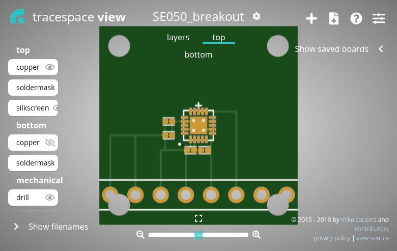
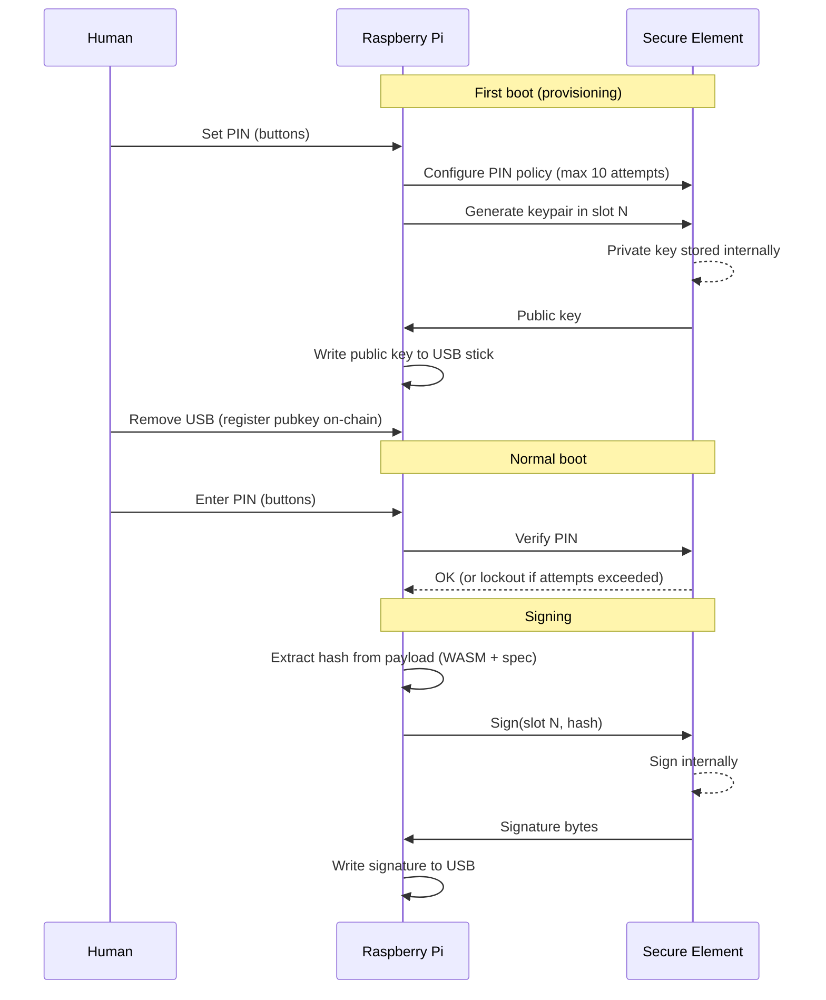

# Secure Element

## Why

Private keys stored on an SD card (even encrypted) are vulnerable to offline
brute-force. A 6-digit PIN has ~20 bits of entropy — a GPU rig cracks
Argon2id-protected keys in hours.

A hardware secure element solves this: the chip holds the private key
internally, enforces PIN retry limits (e.g. lockout after 10 failures),
and never exports key material. A stolen SD card contains no secrets.

## Hardware

**NXP SE050C1HQ1** — EdgeLock SE050, HX2QFN20 package (3×3 mm).

- I2C interface (SDA/SCL on Pi GPIO 2/3)
- Native Ed25519, secp256k1, and NIST P-256 support
- Hardware key generation and signing — private key never leaves the chip
- PIN retry policy enforced in hardware
- Secure key storage with multiple slots
- CC EAL6+ certified

!!! note "Why SE050 over ATECC608B"
    The ATECC608B (~2 EUR) only supports ECDSA P-256 natively. Cardano and
    Bitcoin require Ed25519 / secp256k1, which would force the Pi to handle
    raw key material in RAM. The SE050 (~5-10 EUR) signs natively with these
    curves — the private key never reaches the Pi.

## Breakout board

A custom 20×20 mm breakout board connects the SE050 to the Pi via an 8-pin
header. It includes decoupling caps, I2C pull-up resistors, and mounting
holes.



Generate Gerber files with `just gerbers` (see `generate_gerbers.py` for the
full specification in `generate_gerbers.prompt.md`).

## Key lifecycle



## HAL trait

```rust
pub trait SecureElement {
    /// Verify the user PIN. Returns remaining attempts on failure.
    fn verify_pin(&mut self, pin: &[u8]) -> Result<(), SeError>;

    /// Generate a keypair in the given slot. Returns the public key.
    fn generate_key(&mut self, slot: u8) -> Result<Vec<u8>, SeError>;

    /// Sign a hash using the key in the given slot.
    /// Requires prior PIN verification in the same session.
    fn sign(&mut self, slot: u8, hash: &[u8]) -> Result<Vec<u8>, SeError>;

    /// Read the public key from a slot.
    fn public_key(&self, slot: u8) -> Result<Vec<u8>, SeError>;
}
```

## Threat model

| Threat | Mitigation |
|--------|------------|
| Stolen SD card | No secrets on SD — SE holds all keys |
| Stolen device (powered off) | PIN required on every boot, SE locks after N failures |
| Stolen device (powered on) | Physical access to buttons required to confirm each signing |
| Side-channel on Pi | Pi never handles raw key material — SE050 signs internally |
| Glitch attack on SE | SE050 CC EAL6+ certified, tamper-resistant |
| USB-borne malware | WASM sandbox: no host imports, fuel-limited, memory-capped |
