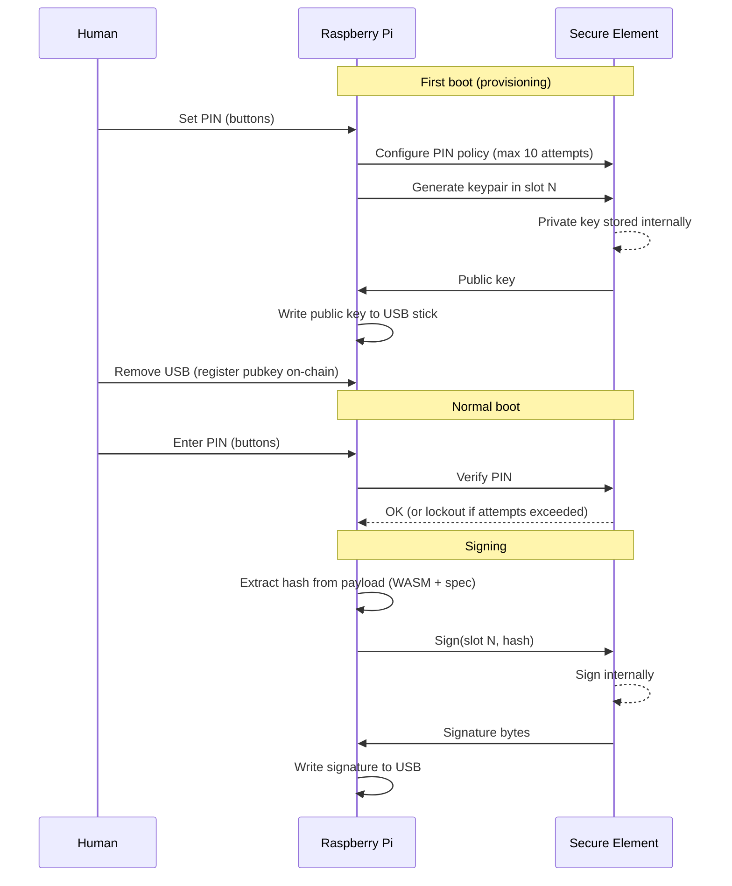

# Secure Element

## Why

Private keys stored on an SD card (even encrypted) are vulnerable to offline
brute-force. A 6-digit PIN has ~20 bits of entropy — a GPU rig cracks
Argon2id-protected keys in hours.

A hardware secure element solves this: the chip holds the private key
internally, enforces PIN retry limits (e.g. lockout after 10 failures),
and never exports key material. A stolen SD card contains no secrets.

## Hardware

**ATECC608B** (Microchip) — ~2 EUR, SOIC-8 or UDFN-8 package.

- I2C interface (SDA/SCL on Pi GPIO 2/3)
- 16 key slots, each with independent access policies
- Hardware ECC P-256 key generation and signing
- Monotonic counter for PIN attempts
- Tamper detection (voltage/clock glitch protection)
- Available on breakout boards for prototyping (Adafruit ATECC608)

!!! note "Algorithm support"
    The ATECC608B natively supports **ECDSA P-256** (secp256r1). For Ed25519
    and secp256k1 (required by Cardano and Bitcoin), there are two paths:

    1. **ATECC608B as key vault** — store raw key bytes in a data slot with
       read-protection. The Pi reads the slot after PIN verification, signs
       in software, and zeroizes immediately. The SE enforces PIN retry
       limits but doesn't do the signing itself.
    2. **SE050 / Optiga Trust M** — higher-end secure elements with native
       Ed25519 and secp256k1 support (~5-10 EUR). The chip does the signing.

    Option 1 is simpler and cheaper. Option 2 is more secure (key never
    reaches Pi RAM). Both are vastly better than encrypted-SD-card.

## Key lifecycle



## HAL trait

```rust
pub trait SecureElement {
    /// Verify the user PIN. Returns remaining attempts on failure.
    fn verify_pin(&mut self, pin: &[u8]) -> Result<(), SeError>;

    /// Generate a keypair in the given slot. Returns the public key.
    fn generate_key(&mut self, slot: u8) -> Result<Vec<u8>, SeError>;

    /// Sign a hash using the key in the given slot.
    /// Requires prior PIN verification in the same session.
    fn sign(&mut self, slot: u8, hash: &[u8]) -> Result<Vec<u8>, SeError>;

    /// Read the public key from a slot.
    fn public_key(&self, slot: u8) -> Result<Vec<u8>, SeError>;
}
```

## Threat model

| Threat | Mitigation |
|--------|------------|
| Stolen SD card | No secrets on SD — SE holds all keys |
| Stolen device (powered off) | PIN required on every boot, SE locks after N failures |
| Stolen device (powered on) | Physical access to buttons required to confirm each signing |
| Side-channel on Pi | Pi never handles raw key material (option 2) |
| Glitch attack on SE | ATECC608B has voltage/clock glitch detection |
| USB-borne malware | WASM sandbox: no host imports, fuel-limited, memory-capped |
