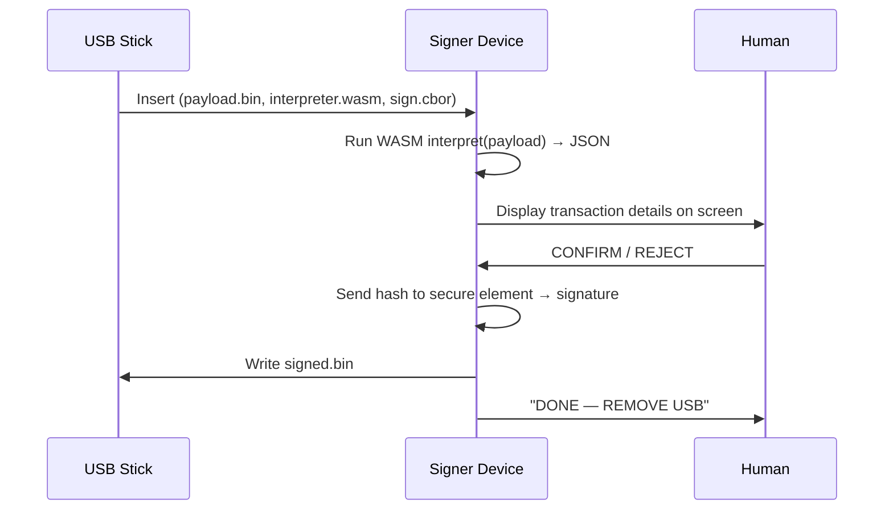

# Air-Gapped Transaction Signer

A blockchain-agnostic air-gapped signing device for Raspberry Pi (4 or Zero 2W).

The device never touches a network. Transactions arrive on a USB stick, get displayed for human review, and are signed with keys held in a secure element that never exposes them.

## How it works

## Key properties

- **Blockchain-agnostic** — the USB stick carries a WASM interpreter that knows
  how to parse the specific transaction format. The device only knows how to
  run WASM, render JSON, and sign bytes.
- **Air-gapped** — no networking hardware enabled. No WiFi, no Bluetooth,
  no Ethernet. Only USB mass storage for data transfer.
- **Secure element** — private keys live in an ATECC608B chip connected via
  I2C. The Pi never sees raw key material. The chip enforces PIN retry limits
  in hardware (lockout after N failures), so a stolen SD card is worthless.
- **Sandboxed interpreters** — WASM modules run with zero host imports,
  fuel-metered (10M ops), and memory-capped (16 MB).
- **Minimal attack surface** — Buildroot Linux with a stripped kernel,
  read-only rootfs, our binary as PID 1.

## Project status

Currently in **Phase 0** — foundation crate with signing spec types,
WASM sandbox, Ed25519 crypto, and a trivial echo interpreter.
See [Phases](dev/phases.md) for the roadmap.
